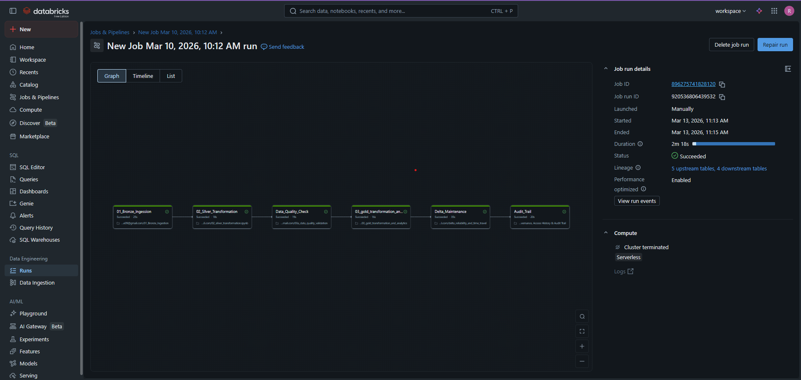

# 🚀 End-to-End E-Commerce Lakehouse Pipeline (Databricks)

 

## 📌 Project Overview
This project implements a production-grade **Medallion Architecture** using **Azure Databricks** and **Delta Lake**. It processes **4,000+ daily e-commerce transactions**, utilizing automated quality gates and self-healing orchestration to ensure data integrity. 

This pipeline is a code-native evolution of the high-volume ETL workflows (80L+ records) I managed at **Accenture**, optimized for modern cloud-scale compute.

---

## 🛠 Tech Stack
* **Compute:** Azure Databricks (Spark 3.5+)
* **Storage:** Delta Lake (ACID compliant)
* **Languages:** PySpark, SparkSQL, Python
* **Orchestration:** Databricks Workflows

---

## 🏗 Medallion Architecture & Workflow
The pipeline is orchestrated via **Databricks Workflows** with a specific dependency chain:

1. **Bronze (Ingestion):** Raw data capture into Delta tables.
2. **Silver (Refinement):** Deduplication, data casting, and schema enforcement.
3. **Data Quality Gate (03a):** A custom **"Circuit Breaker"** notebook that catches NULLs and quarantines "poisoned" data. It includes an automated **Kill Switch** that halts the pipeline if corruption exceeds strict thresholds.
4. **Gold (Aggregates):** Final business-level reporting tables (Revenue, Order Trends) ready for PowerBI/Tableau.
5. **Reliability & Maintenance:** Automated `VACUUM` and **Time Travel** verification to ensure 100% recoverability.
6. **Governance:** Automated Audit Trail logging for compliance and access history.

---

## 🚀 Key Engineering Features
* **Automated Quality Gates:** Implemented a quarantine/hospital pattern to isolate bad records without failing the healthy data load.
* **Schema Evolution:** Enabled the pipeline to seamlessly adapt to source data structure changes.
* **Time Travel Recovery:** Verified the ability to restore data to a specific version (`VERSION AS OF`) to recover from accidental deletions or corrupted runs.

---

## 🛠️ Challenges & Technical Troubleshooting
During the development of this pipeline, I encountered and resolved several production-level hurdles:

### 1. Delta Lake Retention Constraints
* **Challenge:** Encountered `DELTA_UNSUPPORTED_TIME_TRAVEL` errors when attempting to access historical versions older than the default 168-hour (7-day) retention period.
* **Resolution:** Implemented dynamic Python logic to fetch the most recent valid version from `DESCRIBE HISTORY` and adjusted `delta.deletedFileRetentionDuration` to ensure reliability tests remained within supported windows.

### 2. Hardened DBFS Security
* **Challenge:** The environment had the "Public DBFS root" disabled, blocking standard `DataFrameWriter` CSV exports for project documentation.
* **Resolution:** Developed a **Memory-Stream Export** using a Pandas bridge and Base64 encoding to generate direct browser download links, bypassing infrastructure-level storage restrictions.

### 3. Schema Mismatch & Evolution
* **Challenge:** Pipeline failures during the Silver-to-Gold transition due to changing source schemas.
* **Resolution:** Used `CREATE TABLE ... AS SELECT ... WHERE 1=0` patterns to clone exact table structures, ensuring the Quarantine "Hospital" tables always matched the primary table schema.

### 4. Syntax & Environment Compatibility
* **Challenge:** Encountered `[PARSE_SYNTAX_ERROR]` when attempting to use modern SQL variables (`DECLARE/SET`) in a constrained Spark SQL environment.
* **Resolution:** Pivoted to a **Hybrid Python-SQL approach**, utilizing `dbutils.widgets` to pass dynamic parameters between different notebook cells seamlessly.

---

## 🔄 Migration Insight (IICS to Databricks)
Moving from **IICS (Informatica)** to **Databricks**, I replaced traditional Mapping Tasks with dynamic Spark logic. Check the repository files to see how standard drag-and-drop ETL logic is translated and optimized for distributed execution on Spark clusters.
