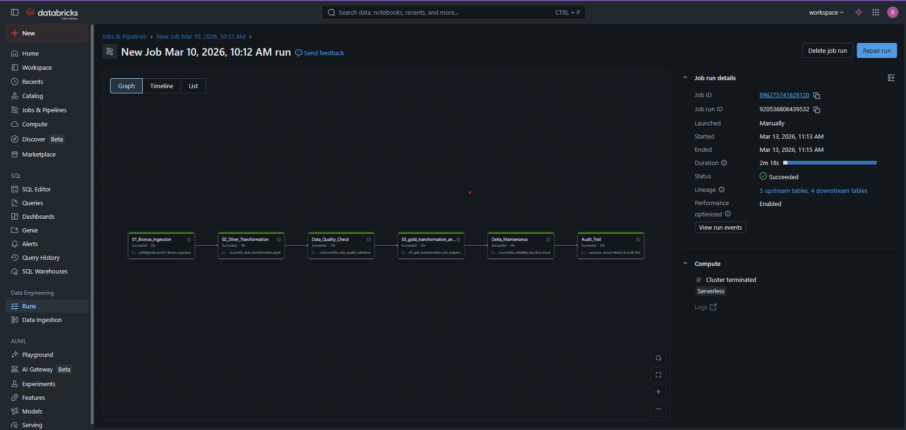

# 🚀 End-to-End E-Commerce Lakehouse Pipeline (Databricks)

 

## 📌 Project Overview
This project implements a production-grade **Medallion Architecture** using **Azure Databricks** and **Delta Lake**. It processes **4,000+ daily e-commerce transactions**, utilizing automated quality gates and self-healing orchestration to ensure data integrity. 

This pipeline represents a code-native evolution of high-volume ETL workflows (80L+ records), optimized for modern cloud-scale compute, cost-efficiency, and deep observability.

---

## 🛠 Tech Stack
* **Compute:** Azure Databricks (Spark 3.5+)
* **Storage:** Delta Lake (ACID compliant)
* **Catalog:** Spark SQL (Metastore: `rishikesh_db`)
* **Languages:** PySpark, SparkSQL, Python
* **Orchestration:** Databricks Workflows

---

## 🏗 Medallion Architecture & Workflow
The pipeline is orchestrated via **Databricks Workflows** with a robust dependency chain:

1. **Bronze (Ingestion):** Raw data capture into Delta tables with strict schema enforcement.
2. **Silver (Refinement):** Deduplication, data casting, and enrichment. Implemented a **Data Governance & Audit Trail** to track lineage and record-level metadata.
3. **Data Quality Gate (03a):** A custom **"Circuit Breaker"** notebook that catches NULLs and quarantines "poisoned" data. It includes an automated **Kill Switch** that halts the pipeline if corruption exceeds strict thresholds.
4. **Gold (Aggregates):** Highly optimized reporting tables (**Z-Ordered** by `Customer`) and a business-facing **Executive View** (`v_executive_sales_dashboard`).
5. **Reliability & Maintenance:** Automated `OPTIMIZE` and `VACUUM` tasks to manage storage costs and query performance.

---

## 📊 Business Intelligence & Executive Insights
*The following insights were generated using the final Gold layer within the Databricks SQL environment:*

* **Revenue Concentration:** Identifying "Whale" customers through Top-10 Revenue aggregation.
* **Temporal Trends:** 10-day rolling revenue analysis to monitor growth patterns and pipeline stability.
* **Customer Value Analysis:** A multi-dimensional scatter plot identifying high-margin vs. high-volume customers to drive targeted marketing strategies.

*(Place your screenshots here: screenshots/revenue_bar.png | screenshots/trend_line.png | screenshots/value_scatter.png)*

---

## 🔄 Modernization Perspective: From IICS to Databricks
Drawing on professional experience with **Informatica Intelligent Cloud Services (IICS)**, this project demonstrates a strategic shift toward a **Modern Data Stack**:
* **Code-Native Logic:** Replaced "black-box" IICS Mapping Tasks with modular, version-controlled **PySpark** code, allowing for unit testing and CI/CD integration.
* **Elastic Scaling:** Transitioned from fixed-resource ETL agents to auto-scaling Spark clusters, significantly reducing processing windows for high-volume datasets.
* **Advanced Governance:** Improved upon traditional ETL logging by implementing **Delta Lake Time Travel** and custom Audit Trails, providing 100% data recoverability and transparent lineage that legacy tools often lack.

---

## 🛠️ Challenges & Technical Troubleshooting

### 1. Delta Lake Retention Constraints
* **Challenge:** Encountered `DELTA_UNSUPPORTED_TIME_TRAVEL` errors when accessing versions older than the 7-day retention period.
* **Resolution:** Implemented dynamic Python logic to fetch the most recent valid version from `DESCRIBE HISTORY` and adjusted `delta.deletedFileRetentionDuration` to ensure reliability tests remained valid.

### 2. Hardened DBFS Security
* **Challenge:** Public DBFS root was disabled in the environment, blocking standard CSV exports.
* **Resolution:** Developed a **Memory-Stream Export** using a Pandas bridge and Base64 encoding to generate direct browser download links, bypassing infrastructure-level storage restrictions.

### 3. Schema Mismatch & Evolution
* **Challenge:** Pipeline failures during Silver-to-Gold transitions due to changing source schemas.
* **Resolution:** Utilized `CREATE TABLE ... AS SELECT ... WHERE 1=0` patterns to clone exact table structures, ensuring "Hospital" tables always matched the primary table schema for seamless data recovery.

---

### 🏁 Project Completion Notice
This project is officially closed. The next phase of development will focus on a **Real-Time Healthcare ML Pipeline** utilizing Structured Streaming and predictive modeling.
